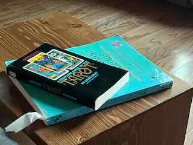

# Arcan.a

### A C static library for the Tarot



A cross-platform C library that generates tarot readings from a full 78-card deck. Ships with a Swift Package wrapper and two driver programs — a C CLI and a Swift CLI.

---

## Sample output

```
~ A R C A N . A ~
The cards await...

Your significator:
IX — THE HERMIT  (Upright)

The spread is laid. Your 10-card reading:

  Card 1  —  The Knight of Cups  (Reversed)
  Card 2  —  0 — THE FOOL  (Upright)
  Card 3  —  The VI of Swords  (Upright)
  Card 4  —  XIV — TEMPERANCE  (Reversed)
  Card 5  —  The Ace of Wands  (Upright)
  Card 6  —  The X of Pentacles  (Reversed)
  Card 7  —  III — THE EMPRESS  (Upright)
  Card 8  —  The Queen of Cups  (Upright)
  Card 9  —  The VIII of Swords  (Reversed)
  Card 10 —  XVI — THE TOWER  (Reversed)

May the cards light your way.
```

Three-card spread (`-3`):

```
Three cards rise from the dark:

  Past    —  The VI of Cups  (Upright)
  Present —  XI — JUSTICE  (Reversed)
  Future  —  The Ace of Swords  (Upright)

May the cards light your way.
```

---

## Features

### Deck
- Full 78-card deck: 22 Major Arcana + 56 Minor Arcana (4 suits × 14 cards)
- Fisher-Yates shuffle via `arc4random_uniform`
- Random Upright/Reversed assignment per card
- Court card extraction as significator before shuffle

### Reading modes
| Flag | Mode |
|------|------|
| *(none)* | 10-card spread, printed at once |
| `-3` | 3-card Past / Present / Future spread |
| `-i` | 10-card spread, one card revealed per keypress |
| `-i -3` | 3-card spread, interactive reveal |

### Library
- C99 static library (`libarcan.a`) — embed in any C or C++ project
- Swift Package — import directly from Xcode or `swift build`
- Public header exposes full deck, shuffle, deal, and reading API

---

## Building

### Swift Package Manager (recommended)

```sh
swift build
swift run ArcanaDriver
```

Run tests:

```sh
swift test
```

On Linux, requires `libbsd-dev`:

```sh
sudo apt install libbsd-dev
swift build
```

### CMake

```sh
cmake -B build .
cmake --build build
./build/Arcan.a
```

#### Static binary (Linux only)

Produces a self-contained executable with no runtime dependencies:

```sh
cmake -B build -DARCANA_STATIC=ON .
cmake --build build
```

> macOS does not support fully static binaries (Apple always links `libSystem.dylib`). The flag is ignored with a warning on macOS.

---

## Usage

```
./Arcan.a           10-card reading
./Arcan.a -3        Past / Present / Future reading
./Arcan.a -i        Interactive 10-card reading (press Enter to reveal each card)
./Arcan.a -i -3     Interactive 3-card reading
```

---

## API

### Types (`arcana-types.h`)

```c
typedef struct Card {
    unsigned char index;     // 0–77
    unsigned char inverted;  // 0 = Upright, 1 = Reversed
} Card;

typedef struct Reading {
    Card *deck;
    Card *courtCardForQuerant;
    unsigned char current;   // index of next card to reveal
    unsigned char count;     // total cards in this reading
} Reading;
```

Card index layout:

| Range | Content |
|-------|---------|
| 0–21 | Major Arcana (The Fool → The World) |
| 22–35 | Wands (Ace, II–X, Page, Knight, Queen, King) |
| 36–49 | Cups |
| 50–63 | Swords |
| 64–77 | Pentacles |

### Functions (`arcana.h`)

```c
// Create a card by suit (0–3) and position (1–14)
Card* makeCard(unsigned char suitIndex, unsigned char minorIndex);
Card* getMyCard(unsigned char suitIndex, unsigned char minorIndex); // returns NULL if not a court card

// Deal a shuffled 77-card deck, removing the significator
// myCard must be a court card; returns NULL otherwise
Card* deal(Card *myCard);

// Shuffle a deck in place (Fisher-Yates)
Card* shuffle(Card *deck);

// Non-interactive readings — print all cards at once
void readMyTarot(Card *deck);    // 10-card
void readThreeCard(Card *deck);  // 3-card Past/Present/Future

// Interactive readings — call continueReading() once per keypress
Reading* startReading(Card *myCard, Card *deck, unsigned char count);
unsigned char continueReading(Reading *reading); // returns 1 while cards remain, 0 when done

// Card display
void identifyCard(Card *card);          // prints name and Upright/Reversed
unsigned char isCourtCard(Card *card);  // Page, Knight, Queen, King

// String lookups
const char* getMajorString(unsigned int cardNumber);  // e.g. "IX — THE HERMIT"
const char* getMinorString(unsigned int suitIndex);   // e.g. "VI", "Knight"
const char* getSuit(unsigned int suitIndex);          // e.g. "Cups"

// Validation
unsigned char validateCard(Card *card);
unsigned char getIndex(unsigned char suitIndex, unsigned char minorIndex);

// CLI config
ArcanaConfig getConfig(int argc, const char *argv[]);
```

### Memory ownership

| Function | Caller must `free()` |
|----------|----------------------|
| `makeCard` | yes |
| `getMyCard` | yes (if non-NULL) |
| `deal` | yes |
| `startReading` | yes |

---

## Architecture

```
Sources/
├── Arcana/              C static library (libarcan.a)
│   ├── arcana-types.h   Structs, enums, constants
│   ├── arcana.h         Public API
│   ├── arcana.c         Implementation
│   └── CMakeLists.txt
├── ArcanaDriver/        Swift CLI driver
│   └── main.swift
├── ArcanaTests/         XCTest suite
│   └── ArcanaTests.swift
└── linux-lbsd/          SwiftPM system module shim for libbsd
    ├── module.modulemap
    └── cbsd-bridging.h
main.c                   C CLI driver (CMake target)
CMakeLists.txt
Package.swift
```

---

## Cross-platform notes

| Platform | `arc4random_uniform` source | Notes |
|----------|-----------------------------|-------|
| macOS | `<stdlib.h>` | No extra dependencies |
| Linux (modern) | `<stdlib.h>` (glibc ≥ 2.36) | No extra dependencies |
| Linux (older) | `<bsd/bsd.h>` via `libbsd` | Install `libbsd-dev` |
| WSL | Same as Linux | |

CMake auto-detects which case applies via `CheckSymbolExists`.

---

## TODO

- Expand test coverage across all card operations and reading flows
- Analyse reading composition (suit balance, Major Arcana weight)
- Refine Swift interface for use in a GUI layer
